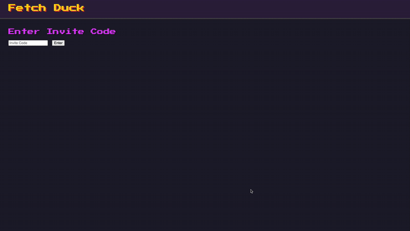

# 🦆 Fetch-Duck: Automated Invoice Processor
 **Fetch-Duck is a full-stack web application that automatically scans a user's Gmail for invoices, stages them for review, and uploads approved documents to accounting software.**

This project is a complete, production-ready system demonstrating a full software development lifecycle, from backend API development and secure authentication to a dynamic frontend UI and automated deployment via CI/CD.


## 📸 Demo & Screenshots

**Live Application URL:** [https://fetch-duck-757437772859.me-west1.run.app](
      https://fetch-duck-757437772859.me-west1.run.app)
    *(Invite Code: `Ask and you shall be given`)*

*A short GIF demonstrating the login and approval workflow.*


**Screenshots:**


| Login Screen | Staged Invoices View |
| :---: | :---: |
|  |  |


## ✨ Features

*   **Secure Gated Access:** Application is protected by a secret invite code to prevent unauthorized access.
*   **Google OAuth 2.0 Authentication:** Secure, three-legged OAuth2 flow for user login and API            authorization.
*   **Persistent Sessions:** Uses a stateful, database-backed session management system for robust user authentication.
*   **Automated Gmail Scanning:** A background process scans the user's Gmail account for potential invoices using keyword matching.
*   **Invoice Staging & Review UI:** A clean, dynamic frontend built with vanilla JavaScript that allows users to:
*   View all staged invoices in a paginated table.
*   Approve or reject invoices with a single click.
*   Receive real-time success and error notifications.
*   **Durable & Decoupled File Processing:**
*   **Gmail Attachment Parsing:** Recursively searches complex email MIME structures to find and extract file attachments.
*   **AWS S3 Integration:** Approved invoices are securely uploaded to a private S3 bucket for durable, long-term storage and auditing.
*   **Accounting API Integration:** Approved invoices are automatically uploaded to the
      Green Invoice staging area via their two-step, pre-signed URL process.
*   **CI/CD Pipeline:** Fully automated quality checks and deployments using GitHub
      Actions.
*   **Continuous Integration:** On every pull request, the pipeline runs linters (
      `golangci-lint`), security scanners (`gosec`), and unit tests (`go test -race`).
*   **Continuous Deployment:** On every push to `main`, the application is
      automatically containerized with Docker and deployed to Google Cloud Run.
*   **Cloud-Native Architecture:** The application is deployed as a stateless container on
      Google Cloud Run, with configuration and secrets managed by GCP Secret Manager.


## 🏗️ Architecture & Tech Stack

*(A simple diagram can be very effective here. You can create one easily with a tool like
      Excalidraw or diagrams.net.)*

**Architecture Diagram:**


**Tech Stack:**
*   **Backend:** Go, `chi` (for routing), `sqlc` (for type-safe database access), `goose`
      (for migrations).
*   **Frontend:** Vanilla HTML5, CSS3, and JavaScript (ES6+).
*   **Database:** Turso (libSQL).
*   **Authentication:** Google OAuth2, Stateful Sessions with Secure Cookies.
*   **Cloud Services:**
     *   **Compute:** Google Cloud Run
     *   **Storage:** AWS S3
     *   **Secrets:** Google Secret Manager
     *   **CI/CD:** GitHub Actions, Docker.
*   **Third-Party APIs:**
     *   Google Mail API
     *   Green Invoice API


## 🚀 Running Locally

 To run Fetch-Duck on your local machine, you will need Go, Docker, and an `.env` file
      configured with the necessary credentials.

 1.  **Clone the repository:**
     ```sh
     git clone https://github.com/felixsolom/fetch-duck.git
     cd fetch-duck
     ```

 2.  **Set up credentials:**
      *   Copy the example environment file: cp `.env.example .env`
      *   Open the new .env file and fill in your actual secret values.

 3.  **Build and Run with Docker (Recommended):**
     *   This method runs the application exactly as it runs in production.

  1. Compile the Go binary for Linux
      CGO_ENABLED=0 GOOS=linux GOARCH=amd64 go build -o fetch-duck .

  2. Build the Docker image
      `docker build -t fetch-duck:local .`

  3. Run the container using the .env file
    ```
      docker run --rm -p 8080:8080 --env-file .env --name fetch-duck-container fetch-duck:local
    ```


  4.  **Access the application:**
     *   Navigate to `http://localhost:8080` in your web browser.


## 🤝 Contributing
Contributions are welcome and greatly appreciated! Whether it's reporting a bug, suggesting a feature, or submitting a code change, every contribution helps.


## 🤔 Architectural Decisions & Lessons Learned

For authentication between the frontend and backend, I had a choice between stateless JWTs
and stateful, database-backed sessions. I chose stateful sessions for a few key reasons:

1.  **Superior Security & Control:** The primary benefit is the ability to instantly
invalidate a user's session by simply deleting their record from the `sessions` table. This
is a powerful security feature, especially for an application that manages access to
sensitive Gmail data.
2.  **No Client-Side Storage of Payload:** The session token sent to the client is an
    opaque, meaningless string, ensuring no user data is ever decoded on the client side.
3.  **Simplicity at Scale:** For a single backend service, the performance overhead of a
database lookup per request is negligible, and the security benefits outweigh the
scalability advantages of JWTs that would be more relevant in a large, distributed
microservices architecture.

 #### The Challenge of Third-Party APIs

 Integrating with the Green Invoice API was a valuable lesson in working with real-world
 documentation. The process for uploading a file was a complex, two-step flow that required
 careful debugging: first, a `GET` request to a specific subdomain
 (`apigw.greeninvoice.co.il`) to get a pre-signed S3 POST policy, followed by a `POST`
 request to the provided S3 URL with a `multipart/form-data` body. This required careful
 attention to detail and systematic debugging to resolve the `400 Bad Request` errors caused
 by incorrect headers and URL parameters.


## The Why
As a small business owner, I've been dealing with admin myself with different degrees of success for some time now. And sure I've heard of people that are amazing and maticulous with gathering every piece of receipt from buying a car to paying a cab driver, but I'm not like that, keeping track of menial receipts never was a priority, and yet. it is important. And so fetch-duck comes into play. What's better thah full automation of your gmail invoice stream into one background nice process, that also takes care of uploading it to you neighbor friendly acounting API? Yes, exactly, nothing. And this is how fetch - duck idea was born. 
That, or my wife told me about some app that does it, and I retorted, buying this? No way. I'm building it myself. 
